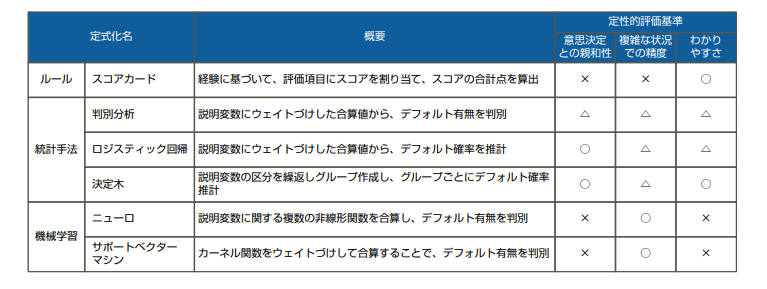
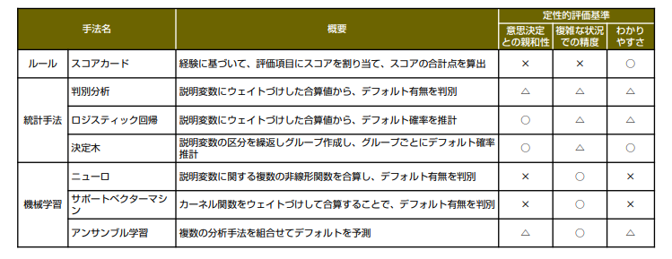

# クレジットスコアリングモデル構築/運用支援

クレジットスコアリングモデルは、取引相手の信用力を評価する与信業務において多くの金融機関やクレジットカード会社に用いられている。

課題
* モデルが複雑なため、作成過程や計算過程がブラックボックス
* モデルの精度に不安があり、モデルを見なおして精度を向上させる必要がある
* モデルを見直し度に、コンサルティングやシステム改修の費用がかかる
* ビッグデータを活用し、トランザクション・レンディングなど新しい与信商品を提供したい(2016追加分)

### 富士通のソリューション(2016)
1. モデルの作成過程や計算過程がブラックボックス
  * 研修の実施
  * モデルの運用目的を考慮して、精度とわかりやすさのトレードオフを考慮した分析手法の提案
2. モデルの精度が低い
  * 精度がクリティカルな場合は精度を追求して最新の機械学習手法を使う
3. モデルを見直す際の費用
  * テンプレートの使用によりエンドユーザーにもモデル見直しが可能に
4. ビッグデータを活用した新しい与信商品
  * スコアリングモデルの構築(2016追加分)

### クレジットスコアリングオプションの例

### 費用
500万円~
